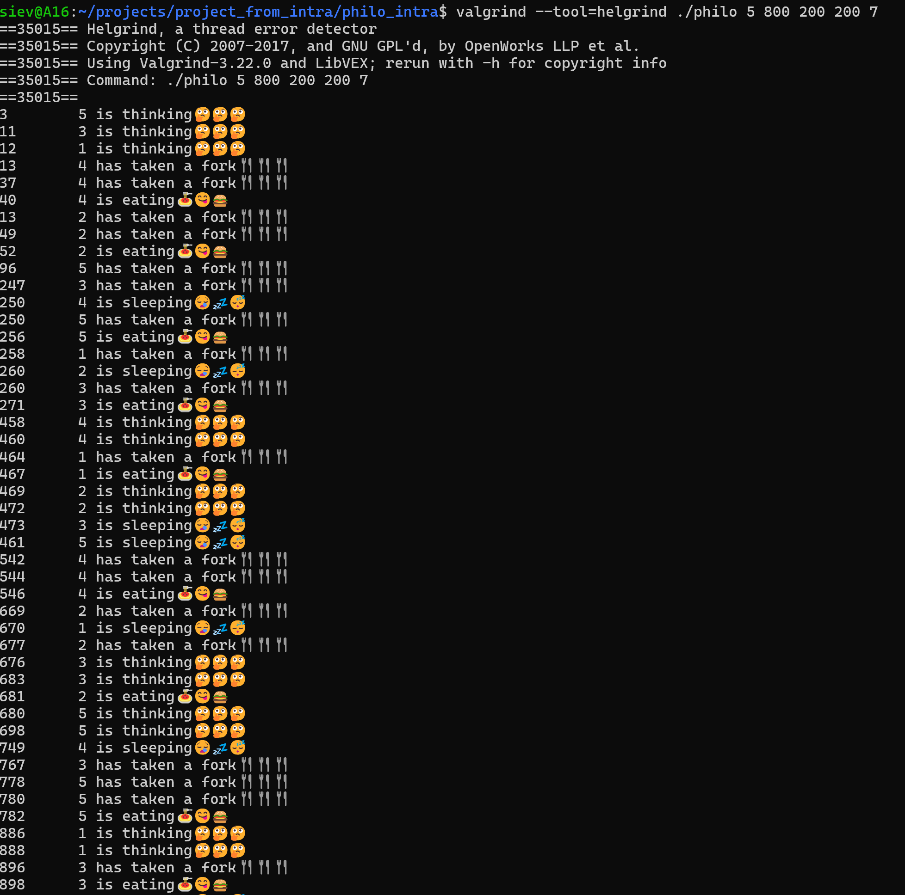
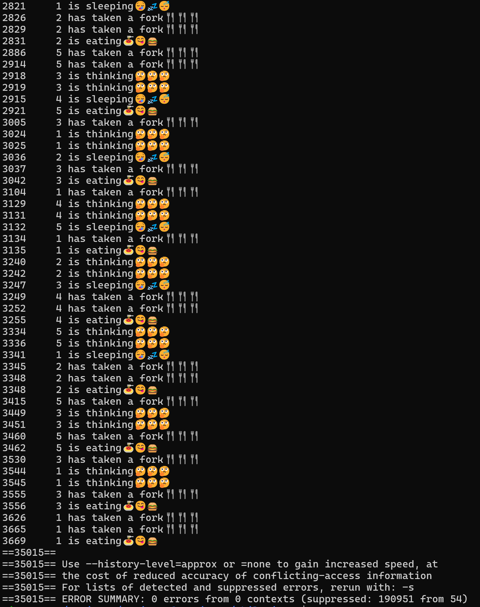

<h1 align="center">Philosophers (multithreading and mutexes project)</h1>

This project is an implementation of the classic Dining Philosophers problem in C, focusing on multithreading and mutexes and managing sychronisation in a concurrent environment.

<h2>📌 Table of Contents</h2>
<ul>
  <li><a href="#about">About</a></li>
  <li><a href="#What is the Dining Philosopher problem?">Problem</a></li>
  <li><a href="#compilation">Compilation</a></li>
  <li><a href="#execution">Execution</a></li>
  <li><a href="#screenshots">Screenshots</a></li>
</ul>

<h2 id="about">📖 About</h2>

The Dining Philosophers problem illustrates synchronization issues and solutions in concurrent programming. Philosophers sit at a table, alternating between eating, thinking, and sleeping. Each needs two forks (mutexes) to eat, and the program must prevent deadlocks and data races.

<h2 id="about"> 🤔 What is the Dining Philosopher problem?</h2>

 

The Dining Philosophers problem is a classic synchronization puzzle that demonstrates how several philosophers (for example, 5 philosophers) sit at a table with the same number of forks (5 forks). Each philosopher needs two forks to eat, but there is only one fork between each pair of philosophers. The challenge is to design a system where philosophers can eat without causing deadlock or starvation. 
<a href="https://en.wikipedia.org/wiki/Dining_philosophers_problem" target="_blank">Learn more on Wikipedia</a>

<h2 id="about">🛠️ Compilation</h2>

<pre><code class="bash">
make
</code></pre>

<em>Running <code>make</code> to compile the pph</em>

<h2 id="about">👨‍💻 Execution</h2>

After compilation, run the program with the following syntax:

<pre><code class="bash">
./philo number_of_philosophers time_to_die time_to_eat time_to_sleep [number_of_times_each_philosopher_must_eat]
</code></pre>

<ul>
  <li><strong>number_of_philosophers</strong>: Number of philosophers (and forks)</li>
  <li><strong>time_to_die</strong>: Time in milliseconds before a philosopher dies if they don’t eat</li>
  <li><strong>time_to_eat</strong>: Time in milliseconds a philosopher spends eating</li>
  <li><strong>time_to_sleep</strong>: Time in milliseconds a philosopher spends sleeping</li>
  <li><strong>number_of_times_each_philosopher_must_eat</strong> (optional): Simulation ends when each philosopher has eaten this many times</li>
</ul>

<strong>Example:</strong>

<pre><code class="bash">
./philo 5 800 200 200 7
</code></pre>

<h3>🧪 Checking for Thread Errors with Helgrind</h3>

You can use <strong>Helgrind</strong> (a Valgrind tool) to check your program for data races and synchronization errors in multithreaded code. Helgrind analyzes your program as it runs and reports any potential issues with thread safety, such as two threads accessing shared data at the same time without proper locking.

To run your program with Helgrind, use:

<pre><code class="bash">
valgrind --tool=helgrind ./philo 5 800 200 200 7
</code></pre>

Below is an example screenshot of Helgrind in action:

 
 

<b>Note:</b> If you run the program with arguments that prevent any philosopher from dying (for example, all philosophers eat enough times), the program may not terminate by itself. In such cases, stopping the program manually with <code>Ctrl+C</code> is normal. This may cause Helgrind or Valgrind to report an error due to the abrupt termination—this is expected and not a problem with your code.

